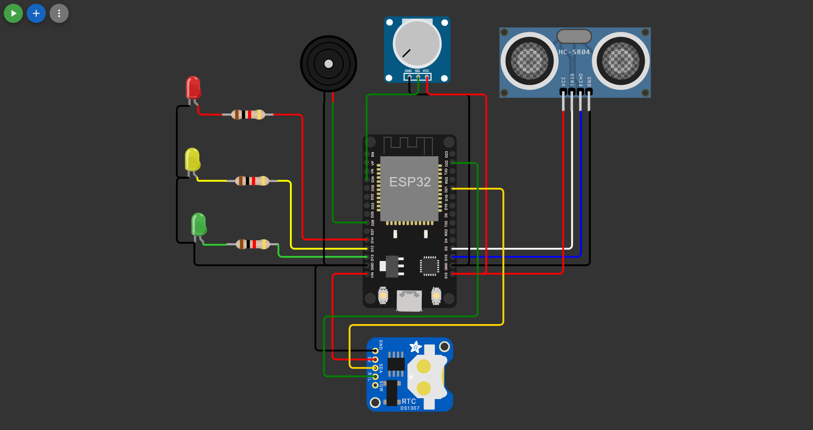
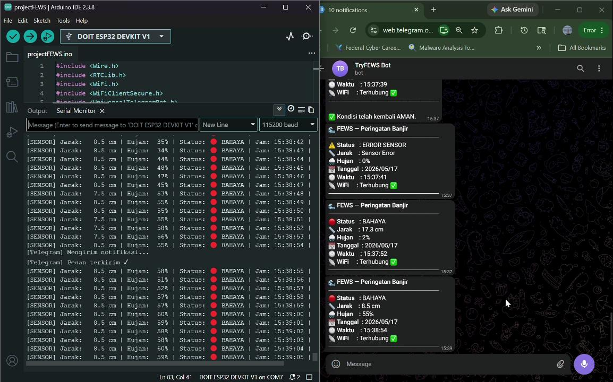
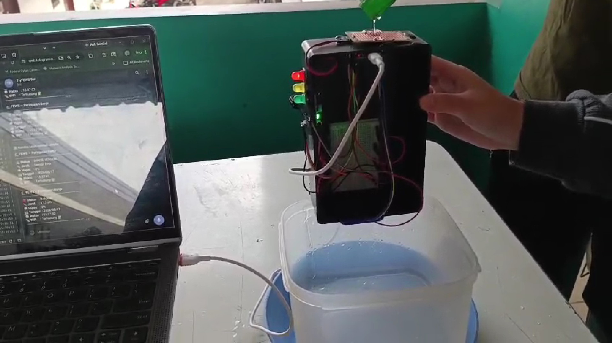

# 🌊 FEWS — Flood Early Warning System (Context-Aware)

> FEWS-IoT is a **Flood Early Warning System** prototype designed to monitor water levels and rain intensity in real-time. This system integrates an ultrasonic sensor, an analog rain sensor, and an RTC module to generate smart and contextual alerts.

> Notifications are automatically sent to a **Telegram** channel, allowing officers or residents to receive warnings without having to monitor the device directly.
This project is simulated using the **[Wokwi](https://wokwi.com/projects/461632741819653121)** platform.

---

### 🖼️ Virtual Circuit Design


### 📊 System Testing Results


### 🎬 Device Testing Demo


---
## ✨ Key Features

| Feature | Description |
|---|---|
| 🔴 **3-Color LED Indicator** | Green / Yellow / Red according to the danger level |
| 🔔 **Buzzer Alarm** | Different sound patterns for each level, louder at night |
| 📱 **Telegram Notifications** | Automatic broadcast with adaptive intervals |
| 🌙 **Day/Night Mode** | More aggressive response at night via RTC DS1307 |
| ⚡ **Non-Blocking Timer** | Uses `millis()` to keep the system always responsive |
| 🌧️ **Rain Intensity Classification** | Clear / Moderate Rain / Heavy Rain |
| 💬 **`/status` Command** | Check real-time conditions anytime via Telegram |

---

## 🚦 Danger Status Logic

The system reads the distance from the ultrasonic sensor as a representation of **water level** (smaller distance = higher water).

| Status | Sensor Distance | LED | Buzzer | Telegram Interval |
|---|---|---|---|---|
| 🟢 **SAFE** | > 100 cm | Green | Off | Not sent |
| 🟡 **WARNING** | 50 – 100 cm | Yellow | Off | Every 5 minutes |
| 🔴 **ALERT 1** | 20 – 49 cm | Red | Intermittent beep | Night: 2 mins / Day: 5 mins |
| 🆘 **EMERGENCY** | < 20 cm | Red | Continuous siren | Night: 1 min / Day: 2 mins |

---

## 🔧 Hardware

### Components

| Component | Specification | 
|----------|-------------|
| ESP32 DevKit V1 | Dual-core 240MHz, built-in WiFi | 
| HC-SR04 + Waterproof Case | Range 2–400cm, ±3mm accuracy | 
| YL-83 Rain Sensor | Analog + digital output | 
| Active Buzzer 5V | 85dB | 
| LED Traffic Light Module | Red / Yellow / Green | 
| Power Supply 5V 2A | DC Adapter |
| Waterproof Box | IP65 | 
| Cables, Breadboard, Resistors | — | 

---

## 🚀 How to Run

### Simulation on Wokwi (Recommended)

1. Open the project link: [https://wokwi.com/projects/461632741819653121](https://wokwi.com/projects/461632741819653121)
2. Enter your Telegram **Bot Token** and **Chat ID** in `sketch.ino` (see the [Telegram Bot Configuration](#-telegram-bot-configuration) section).
3. Click the **▶ Play** button to start the simulation.
4. Turn the potentiometer to adjust the rain intensity.
5. Click the HC-SR04 sensor and change the `distance` value to simulate the water level.

### Deploy to Real Hardware

1. Install **Arduino IDE** and add the **ESP32** board via the Board Manager.
2. Install the required libraries (see `libraries.txt`):
   - `RTClib`
   - `CTBot`
   - `ArduinoJson` (v6.21.5)
3. Open `sketch.ino`, fill in your WiFi and Telegram credentials.
4. Upload the code to the ESP32 board.

---

## ⚙️ Telegram Bot Configuration

Edit the following section in `sketch.ino`:

```cpp
// WiFi Credentials
String ssid = "YOUR_WIFI_NAME";
String pass = "YOUR_WIFI_PASSWORD";

// Telegram Bot
String token = "YOUR_BOT_TOKEN";
const int64_t bot_id = YOUR_CHAT_ID;

```

### How to Get a Bot Token

1. Open Telegram, search for **@BotFather**.
2. Type `/newbot` and follow the instructions.
3. Copy the provided token.

### How to Get a Chat ID

1. Search for the **@userinfobot** bot on Telegram.
2. Type `/start` — the bot will reply with your **Chat ID**.

> ⚠️ **Security Warning:** Do not publish your `token` and `chat_id` to a public repository. Use a separate configuration file or environment variables for production deployment.

---

## 📱 Telegram Bot Commands

| Command | Function |
| --- | --- |
| `/status` | Display the current status (water level, rain, time, level) |

### Example `/status` Response

```
📊 Current FEWS Status
📍 Water level : 75 cm from sensor
🌧️ Rain intensity: Moderate
🕐 Time          : 14:32 WIB (Daytime 06:00–22:00)
📶 Status         : 🟡 WARNING

```

---

## 📋 5 Pervasive Scenarios

See details in `docs/SKENARIO.md`.

| # | Scenario | Time | Condition |
| --- | --- | --- | --- |
| 1 | Early Warning Day | Day | Rain gets heavy, water rises |
| 2 | Alert 1 Day | Day | Critical water + heavy rain |
| 3 | **Alert 1 Night** ⭐ | Night | Critical water + residents sleeping |
| 4 | Condition Improves | Anytime | Water recedes, rain stops |
| 5 | On-Demand Status Check | Anytime | `/status` via Telegram |

---

## 🏗️ System Architecture

```
┌─────────────────────────────────────────────────────────┐
│                      SENSOR LAYER                       │
│   [HC-SR04]           [YL-83]          [NTP/WiFi]       │
│  Water Level       Rain Intensity     Time of Day       │
└──────────┬──────────────────┬──────────────┬────────────┘
           └──────────────────┴──────────────┘
                              │
                    ┌*********▼*********┐
                    │      ESP32        │
                    │   DevKit V1       │
                    │   Logic Engine    │
                    └*********┬*********┘
           ┌──────────────────┼──────────────────┐
           │                  │                  │
    ┌──────▼──────┐   ┌───────▼──────┐   ┌──────▼──────┐
    │  LOCAL OUT  │   │  CLOUD OUT   │   │  LOG DATA   │
    │ LED + Siren │   │ Telegram Bot │   │   SPIFFS    │
    └─────────────┘   └──────────────┘   └─────────────┘

```

---

## 📊 Technology Stack

| Layer | Technology |
| --- | --- |
| Hardware | ESP32 DevKit V1, HC-SR04, YL-83, Buzzer, LED |
| Firmware | Arduino (C++) via PlatformIO |
| Connectivity | Built-in ESP32 WiFi |
| Time Synchronization | NTP (`pool.ntp.org`) — free, no extra module required |
| Notifications | Telegram Bot API (free) |
| Data Logging | SPIFFS (ESP32 internal flash) |
| Optional Dashboard | ThingSpeak / Blynk |
| Simulation | Wokwi |

---

## 📄 License

This project is licensed under the MIT License. Free to use and modify for educational purposes.

---

## 👥 Team

Pervasive Computing Course Project — Informatics Engineering

```
